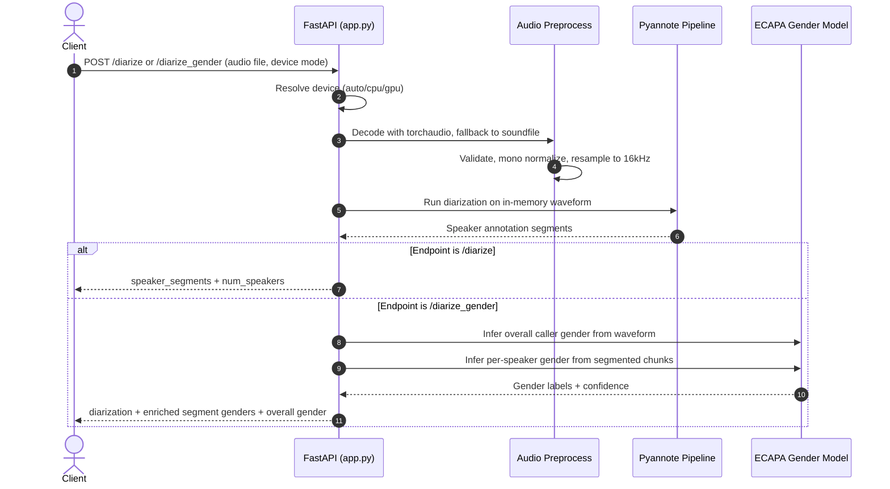

# speaker-diarization-api

FastAPI service for speaker diarization and optional gender classification, with GPU-aware runtime selection.

## General Inference Script

Use `general_inference.py` to run speaker diarization and gender classification
together from a local audio file and return the same JSON structure as
`/diarize_gender`.

Token resolution order used by the script:

1. `--hf-token` CLI flag
2. `HF_TOKEN` from environment
3. `HF_TOKEN` from `.env` in current working directory or script directory

### Terminal Usage

```bash
export HF_TOKEN=your_hf_token
python3 general_inference.py /path/to/audio.wav --device auto --pretty
python3 general_inference.py /path/to/audio.wav --output output.json --pretty
```

### Notebook or `!` Command Usage

When using notebook shell commands, `!export ...` might not persist to the next
`!python3 ...` command. Use one of these patterns instead:

```bash
!HF_TOKEN=your_hf_token python3 general_inference.py /path/to/audio.wav --device auto --pretty
!python3 general_inference.py /path/to/audio.wav --hf-token your_hf_token --output output.json --pretty
```

Or create a `.env` file in the repo:

```bash
HF_TOKEN=your_hf_token
```

## Active Models

- Speaker diarization: mhdp-africa/speaker-segmentation-callhome-voxconverse-diarization-v1
- Gender classification: mhdp-africa/gender_classification_MHDP_asr_dataset_V1

These are loaded from environment variables with the above defaults:

- MODEL_ID
- GENDER_MODEL_ID

## API Endpoints

- GET /health
- POST /diarize
- POST /diarize_gender

## Request Flow Sequence Diagram


