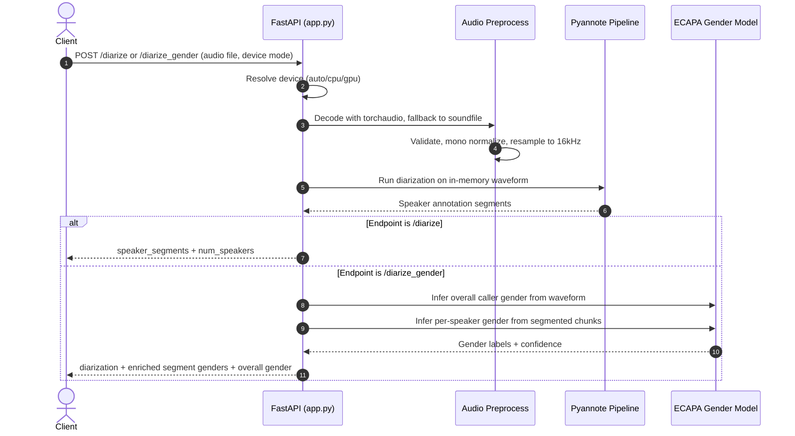

# speaker-diarization-api

## General Inference Script

Use `general_inference.py` to run speaker diarization and gender classification
together from a local audio file and return the same JSON structure as
`/diarize_gender`.

Examples:

```bash
python general_inference.py /path/to/audio.wav --device auto --pretty
python general_inference.py /path/to/audio.wav --output output.json --pretty
```

FastAPI service for speaker diarization and optional gender classification, with GPU-aware runtime selection.

## Active Models

- Speaker diarization: mhdp-africa/speaker-segmentation-callhome-voxconverse-diarization-v1
- Gender classification: mhdp-africa/gender_classification_MHDP_asr_dataset_V1

These are loaded from environment variables with the above defaults:

- MODEL_ID
- GENDER_MODEL_ID

## API Endpoints

- GET /health
- POST /diarize
- POST /diarize_gender

## Request Flow Sequence Diagram

